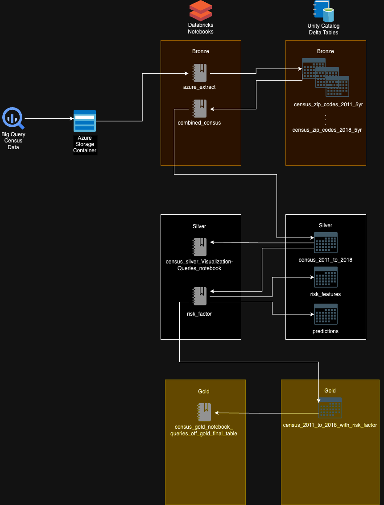

# Risk Factor by Zip Code in the US

This repository provides documentation and notebooks
for a data pipline in Databricks to create a ML model for determining the risk factor for each zip code in the US.


Table of Contents
=================

   * [Databricks Risk Factor by Zip in the US](#databricks-risk-factor-by-zip-in-the-us)
      * [Table of Contents](#table-of-contents)
      * [Project File Structure](#project-file-structure)
      * [Overview](#overview)
         * [Gathering Datasets](#gathering-datasets)
         * [Unity Catalog Setup](#local-steps)
         * [Data Ingestion](#data-ingestion)
         * [Data Transformation](#data-transformation)
         * [ML Model for Determining Risk Factor](#ml-model-for-determining-risk-factor)
      * [Notebooks](#notebooks)
        * [Bronze](#bronze-folder)
        * [Silver](#silver-folder)
        * [Gold](#gold-folder)
    
## Project File Structure
```
. 
├── .bronze
│   ├── azure_extract
|   ├── combined_census
|   └── other_refined_data (not in use)
├── .silver
│   ├── census_silver_notebook
|   ├── happiness_index_regression(not in use)
|   └── risk_factor
├── .gold
|   └── census_gold_notebook
└── README.md
```

Some descriptions regarding files:
- `azure_extract` - Handles data ingestion by gathering datasets from Azure Storage Container.
- `combined_census` - Combines Census datasets, which were seperate datasets for each year from 2011-2018.
- `other_refined_data` - Pulls in other relevant datasets that had data per zip code.
- `census_silver_notebook` - Performs queries on the combined Census data to extract relevant information that could contribute to risk factor and provides visualizations.
- `happiness_index_regression` - Creates a linear regression using arbitrary weights assigned to different features from census data that could potentially impact happiness. The result is a synthetic happines index.
- `risk_factor` - Takes various features from the Census data and uses the Elbow Method to determine the optimal number of clusters (risk factor levels in this case), and uses a KMeans model with that optimal number of clusters to put each zip code into its appropraite risk factor cluster [low risk, moderate risk, high risk].
- `census_gold_notebook` - Performs queries on the Census data by zip code with the risk factor for each zip included.



## Overview

> **_NOTE:_**  
At the time of writing, [ML Models in Unity Catalog](https://learn.microsoft.com/en-us/azure/databricks/mlflow/models-in-uc-example) are in Public Peview.
In this project, we are using [Databricks Runtime 13.2 ML](https://docs.databricks.com/en/release-notes/runtime/13.2ml.html).

### Gathering datasets
We sourced our Census data from Google Big Query's public datasets:
- [US Census Data on Google Big Query](https://console.cloud.google.com/bigquery?p=bigquery-public-data&d=census_bureau_usa&page=dataset&project=ardent-fusion-394216&ws=!1m4!1m3!3m2!1sbigquery-public-data!2scensus_bureau_acs)

The datasets were separated by year from 2011-2018. Thus, we had to do some data transformation to combine these datasets into one table, which can be found [here](#data-transformation).

### Unity Catalog Setup

- Setup a Unity Catalog metastore for easier data governance.
- Followed this easy setup guide on YouTube: [Unity Catalog setup for Azure Databricks](https://www.youtube.com/watch?v=-RwzDRVgjLc), as well as the official [Azure Documentation](https://learn.microsoft.com/en-us/azure/databricks/data-governance/unity-catalog/get-started).


### Data ingestion

- Downloaded Census Data from Google Big Query as parquet.
- Uploaded parquet files to this [Azure Storage Container](https://portal.azure.com/#view/Microsoft_Azure_Storage/ContainerMenuBlade/~/overview/storageAccountId/%2Fsubscriptions%2Fd402e5e9-4b24-4f30-933d-a097415411b6%2FresourceGroups%2FWOLCM01%2Fproviders%2FMicrosoft.Storage%2FstorageAccounts%2Fraw001/path/raw/etag/%220x8DB9468600B6E20%22/defaultEncryptionScope/%24account-encryption-key/denyEncryptionScopeOverride~/false/defaultId//publicAccessVal/None).
- Created azure_extract notebook to gather all parquet files from Azure Storage Container and save them as Delta Tables in our bronze tier data.

### Data transformation

- Created combined_census notebook and pulled in all delta tables for Census data for separate years (2011-2018) from bronze data tier.
- Added primary key to each table formatted: `zipcode_year`.
- Performed a union one table at a time, checking for missing columns to ensure the same schema for all tables.
    * If a table was missing columns, they would be added and filled with null values
- The combined delta table was then saved to the silver data tier.

### ML model for determining risk factor
- Using the combined Census delta table (main.silver.census_2011_to_2018), features that could impact the risk factor of a particular zip code were extracted using a Spark SQL query and converted into a Pandas dataframe.
- For any missing values, mean imputation was used to fill in those gaps.
- The features were then normalized and used in the Elbow Method to determine the optimal number of risk factor clusters.
- After plotting and looking at the Elbow Method graph, it appeared that 3-4 clusters was the optimal number for risk factor clusters.
- Thus, 3 clusters were used for the KMeans model implementation: [`Low Risk`, `Moderate Risk`, `High Risk`]
- The Risk Factor Distribution by Cluster (or Risk Level) is then plotted using a bar graph.
- Finally, a few notebook cells are used to show the risk factor and features from 2011-2018 for one of the worst neighborhoods in Chicago, one of the lowest poverty neighborhoods in the US, and finally for any zip code typed into the 'zip' Databricks widget at the top of the notebook.

 
## Notebooks

### Bronze folder

#### azure_extract:

 ```batch
 !pip install azure-storage-blob pyarrow
 ```
Installs the necessary packages for accessing Azure Blob Storage.

```sql
%sql
USE CATALOG main;
USE main.bronze;
```

Ensure we are using the correct Unity Catalog and bronze data storage.

```python
from azure.storage.blob import BlobServiceClient
import pandas as pd
from io import StringIO, BytesIO
from pyspark.sql import SparkSession
import re

spark = SparkSession.builder \
    .appName("Bronze Combine WUC") \
    .config("spark.jars.packages", "io.delta:delta-core_2.12:1.0.0") \
    .config("spark.sql.extensions", "io.delta.sql.DeltaSparkSessionExtension") \
    .config("spark.sql.catalog.spark_catalog", "org.apache.spark.sql.delta.catalog.DeltaCatalog") \
    .config("spark.jars.packages", "com.johnsnowlabs.nlp:spark-nlp_2.12:latest") \
    .config("spark.kryoserializer.buffer.max", "2000M") \
    .config("spark.sql.legacy.timeParserPolicy", "LEGACY") \
    .getOrCreate()


account_url = "https://raw001.blob.core.windows.net"
container_name = "raw"
sas_token = "sp=rl&st=2023-08-08T00:08:04Z&se=2023-08-22T08:08:04Z&spr=https&sv=2022-11-02&sr=c&sig=2%2FIeIKmKVum5KQqlJw0LflH6pZ97htvQrKQ5fxMu1p0%3D"


blob_service_client = BlobServiceClient(account_url=account_url, credential=sas_token)

container_client = blob_service_client.get_container_client(container_name)

blob_list = container_client.list_blobs()
blob_names = [blob.name for blob in blob_list]

errors = []

blob_names = [x for x in blob_names if '.parquet' in x or '.csv' in x]
# uncomment this and run it, 
# blob_names = [x for x in blob_names if '.csv' not in x and '.parquet' not in x]


for blob_name in blob_names:

    blob_client = container_client.get_blob_client(blob_name)
    bytes = blob_client.download_blob().readall()

    if '.parquet' in blob_name:
        table_name = blob_name.split(".parquet")[0]
        try:
            pdf = pd.read_parquet(BytesIO(bytes))
        except:
            errors.append(blob_name)
    
    if '.csv' in blob_name:
        csv_data = bytes.decode("ISO-8859-1")
        table_name = blob_name.split(".csv")[0]
        try:
            pass
            pdf = pd.read_csv(StringIO(csv_data), header=0, encoding="ISO-8859-1")
        except:
            errors.append(blob_name)
    
    if '.xlsx' in blob_name:
        pass

    
    sdf = spark.createDataFrame(pdf)


    table_name = re.sub(r'[ ,;{}()\n\t=]', '_', table_name)

    print(table_name)
    table_name = ( table_name
    .replace(" ", "_")  
    .replace("-","_")
    .replace("-","_")
    .replace("(", "")
    .replace(")", "")
    .replace("&","")
    .replace("#", "")
    .lower())

    sdf.write \
        .format("delta") \
        .mode("overwrite") \
        .option("inferSchema", "true") \
        .option("mergeSchema", "true") \
        .option('delta.columnMapping.mode', 'name') \
        .saveAsTable("bronze." + table_name)
```
Connects to Azure Blob Storage container and ingests all files in the container that end with .parquet or .csv as well as replacing spaces and other characters with "_" or "" to ensure a uniform naming convention. These files are then converted to Spark dataframes and saved to bronze storage as Delta tables.

#### combined_census:

```python
import requests
ctx = dbutils.notebook.entry_point.getDbutils().notebook().getContext()
api_url = ctx.tags().get("browserHostName").get()
api_token = ctx.apiToken().get()
headers = {'Authorization': f'Bearer {api_token}'}
account_id = ctx.tags().get("accountId").get()
# get metastore id
url = f'https://{api_url}/api/2.1/unity-catalog/metastores'
metastore_id = requests.get(url, headers=headers).json()['metastores'][0]['metastore_id']
# enable lineage tables
url = f'https://{api_url}/api/2.0/unity-catalog/metastores/{metastore_id}/systemschemas/access'
response = requests.put(url, headers=headers)
```
Creates lineage tables.

```sql
%sql
USE CATALOG main;
USE main.bronze;
```
Ensures the correct catalog and data tier are being used.

```python
from pyspark.sql import SparkSession

spark = SparkSession.builder \
    .appName("Bronze Combine WUC") \
    .config("spark.jars.packages", "io.delta:delta-core_2.12:1.0.0") \
    .config("spark.sql.extensions", "io.delta.sql.DeltaSparkSessionExtension") \
    .config("spark.sql.catalog.spark_catalog", "org.apache.spark.sql.delta.catalog.DeltaCatalog") \
    .getOrCreate()
```
Configures the Spark session.

```sql
%sql 
show tables
```
Shows all tables currently saved in bronze storage.

```python
tables = spark.sql("SHOW TABLES").select("tableName").collect()


for table in tables:
    table_name = table.tableName

    print('{}\n\n\n'.format(table_name))

    df = spark.sql(f"select * from {table_name}")

    # display(df)
```
Shows tables in different format.

```python

from pyspark.sql.functions import lit

tables = spark.sql("SHOW TABLES").select("tableName").collect()

tables = [table.tableName for table in tables if 'census_zip_codes' in table.tableName]

print(tables)

spark_dfs_to_combine = []

for table in tables:
    date = table.split('census_zip_codes_')[1].split('_5yr')[0]

    df_to_combine = spark.sql('''
                        select *, concat(geo_id, '_', {date}) as primary_key
                        from {table}
                    '''.format(table=table,date=date))

    df_to_combine = df_to_combine.withColumn("year", lit(date))

    spark_dfs_to_combine.append(df_to_combine)
```
Grabs all of the Census datasets, which are separated by year and adds a column to each with a primary key formatted: `<zipcode/geo_id>_<year>`.

```python
combined = spark.createDataFrame([], schema=spark_dfs_to_combine[0].schema)

final_count=0
for table_df in spark_dfs_to_combine:
    missing_columns = list(set(combined.columns) - set(table_df.columns))
    print(len(missing_columns))

    if len(missing_columns) > 0:
        for col in missing_columns:
            table_df = table_df.withColumn(col, lit(None))
        final_count+=int(table_df.count())
        table_df = table_df.select(*combined.columns)
        combined = combined.union(table_df)
    
    else:
        final_count+=int(table_df.count())
        combined = combined.union(table_df)

print('Expected:',final_count, '\n\n', 'Actual:', combined.count())

display(combined)
```
Combines the Census datasets into one table, adding missing columns and filling them with null values if a particular table is missing them to ensure the schema is exactly the same for all tables, which is a prerequisite for using the `union` operator.

```python
combined.write \
    .format('delta') \
    .mode('overwrite') \
    .option("mergeSchema", "true") \
    .option("overwriteSchema", "true") \
    .saveAsTable('silver.census_2011_to_2018')
```
Saves the combined table to silver tier data storage as a Delta table.

```python
df = spark.sql('''
               select * from silver.census_2011_to_2018 where geo_id = '60624'
               ''')

display(df)
```
A sample query to get census data for zip code `60624` from 2011 to 2018.

#### other_refined_data:

Contains other datasets that were not used in the current model, but provided data by zip code.

### Silver folder

#### census_silver_notebook:

```sql
%sql
USE CATALOG main;
USE main.silver;
```
Ensures the correct catalog and data tier (silver) are being used.

```python
from pyspark.sql import SparkSession

spark = SparkSession.builder \
    .appName("Silver Tests") \
    .config("spark.jars.packages", "io.delta:delta-core_2.12:1.0.0") \
    .config("spark.sql.extensions", "io.delta.sql.DeltaSparkSessionExtension") \
    .config("spark.sql.catalog.spark_catalog", "org.apache.spark.sql.delta.catalog.DeltaCatalog") \
    .getOrCreate()
```
Configures Spark session.

```sql
%sql
show tables
```
Shows current tables in silver data storage.

```python
dbutils.widgets.text("zip", "20148")
zip_ = dbutils.widgets.get("zip")
```
Creates a Databricks widget to enable user to input desired zip code, which will be saved in the `zip_` variable and used in later queries.

```python
spark.sql("""CREATE or REPLACE TEMPORARY VIEW core_view AS
SELECT 
    *
FROM 
    silver.census_2011_to_2018
where geo_id = '{zip_code}'
""".format(zip_code = zip_))

housing_df = spark.sql('''
                        select geo_id, year, housing_units, occupied_housing_units, housing_units_renter_occupied, mobile_homes, housing_built_1939_or_earlier, housing_built_2000_to_2004, housing_built_2005_or_later,
                        vacant_housing_units, vacant_housing_units_for_rent, vacant_housing_units_for_sale
                        from core_view
                        order by primary_key asc
                        ''')

display(housing_df)
```
Creates a temporary view for the specific zip code entered in the widget and performs a query on housing data for that area.

```python
age_and_gender_df = spark.sql('''
                              select geo_id, year,
                                (male_under_5 + male_5_to_9 + male_10_to_14 + male_15_to_17) as male_under_18,
                                (male_18_to_19 + male_20 + male_21 + male_22_to_24 + male_25_to_29) as male_over_18_under_30,
                                (male_30_to_34 + male_35_to_39) as male_over_30_under_40,
                                (male_40_to_44 + male_45_to_49) as male_over_40_under_50,
                                (male_50_to_54 + male_55_to_59) as male_over_50_under_60,
                                (male_60_61 + male_62_64 + male_65_to_66 + male_67_to_69) as male_over_60_under_70,
                                (male_70_to_74 + male_75_to_79) as male_over_70_under_80,
                                (male_80_to_84 + male_85_and_over) as male_80_and_over,

                                (female_under_5 + female_5_to_9 + female_10_to_14 + female_15_to_17) as female_under_18,
                                (female_18_to_19 + female_20 + female_21 + female_22_to_24 + female_25_to_29) as female_over_18_under_30,
                                (female_30_to_34 + female_35_to_39) as female_over_30_under_40,
                                (female_40_to_44 + female_45_to_49) as female_over_40_under_50,
                                (female_50_to_54 + female_55_to_59) as female_over_50_under_60,
                                (female_60_to_61 + female_62_to_64 + female_65_to_66 + female_67_to_69) as female_over_60_under_70,
                                (female_70_to_74 + female_75_to_79) as female_over_70_under_80,
                                (female_80_to_84 + female_85_and_over) as female_80_and_over

                                from core_view
                                order by primary_key asc
                                ''')

display(age_and_gender_df)
```
A query which gets the age and gender of people from the specific zip code but groups them in a more convenient way (10-year increments) than was presented in the original Census data.

```python
pop_and_race_df = spark.sql('''
                          select geo_id, year, total_pop, white_pop, black_pop, asian_pop, hispanic_pop, amerindian_pop, other_race_pop
                          from core_view
                          order by primary_key asc
                          ''')

display(pop_and_race_df)
```
A query that extracts total population as well as population by race for the specific zip code.

```python
commute_df = spark.sql('''
                        select geo_id, year,
                            commute_less_10_mins,
                            (commute_10_14_mins + commute_15_19_mins + commute_20_24_mins + commute_25_29_mins) as commute_over_10_less_30_mins,
                            (commute_30_34_mins + commute_35_39_mins + commute_40_44_mins + commute_45_59_mins) as commute_over_30_less_1_hr,
                            commute_60_more_mins,
                            commute_90_more_mins,

                            commuters_by_public_transportation, commuters_by_subway_or_elevated, commuters_drove_alone, commuters_by_carpool, commuters_by_car_truck_van, commuters_by_bus

                        from core_view
                        order by primary_key asc
                        ''')
display(commute_df)
```
A query which presents the commute data for the specific zip code in a more digestable manner.

```python
all_df = spark.sql('''
                        select *
                        from core_view
                        order by primary_key asc
                        ''')

display(all_df)
```
A query that grabbed all Census data for the specific zip to make it easier to create visualizations on Databricks for data that didn't need any transformation.

#### happiness_index_regression:

Created a synthetic happiness index for each zip code based on arbitrary/subjective weights assigned to various features from the Census data that would potentially impact happiness positively or negatively. Was not what we were looking for.

#### risk_factor:

```sql
%sql
USE CATALOG main;
USE main.silver;
```

Ensures the correct catalog and data tier (silver) storage is being used.

```python
from pyspark.sql import SparkSession

spark = SparkSession.builder \
    .appName("Silver Risk Factor Reg") \
    .config("spark.jars.packages", "io.delta:delta-core_2.12:1.0.0") \
    .config("spark.sql.extensions", "io.delta.sql.DeltaSparkSessionExtension") \
    .config("spark.sql.catalog.spark_catalog", "org.apache.spark.sql.delta.catalog.DeltaCatalog") \
    .getOrCreate()
```
Configures and creates the Spark session.

```python
dbutils.widgets.text("zip", "20148")
zip_ = dbutils.widgets.get("zip")
```
Creates a Databricks widget for inputting desired zip code.

```python
relevant_metrics = spark.sql("""
                              select primary_key, geo_id, year, vacant_housing_units, percent_income_spent_on_rent, one_parent_families_with_young_children, unemployed_pop, less_than_high_school_graduate, households_public_asst_or_food_stamps, no_car, poverty, commute_60_more_mins, pop_divorced, pop_widowed 
                              from main.silver.census_2011_to_2018
                              """)
```
A query that extracts all of the relevant metrics that contribute to risk which can be used as features for our KMeans ML model.

```python
from sklearn.preprocessing import StandardScaler
from sklearn.cluster import KMeans
from sklearn.impute import SimpleImputer
from databricks.feature_store import FeatureStoreClient
import matplotlib.pyplot as plt
import pandas as pd

feature_store = FeatureStoreClient()

# Prepare feature DataFrame

# Convert the Spark DataFrame to a Pandas DataFrame
data_pandas = relevant_metrics.toPandas()

# Select the relevant features
features = [
    "vacant_housing_units",
    "percent_income_spent_on_rent",
    "one_parent_families_with_young_children",
    "unemployed_pop",
    "less_than_high_school_graduate",
    "households_public_asst_or_food_stamps",
    "no_car",
    "poverty",
    "commute_60_more_mins",
    "pop_divorced",
    "pop_widowed"
]

# Handle missing values using mean imputation
imputer = SimpleImputer(strategy="mean")
data_imputed = imputer.fit_transform(data_pandas[features])

# Normalize the features
scaler = StandardScaler()
data_scaled = scaler.fit_transform(data_imputed)

# Use the Elbow Method to find the optimal number of clusters
inertia_values = []

for num_clusters in range(1, 11):
    kmeans = KMeans(n_clusters=num_clusters, random_state=42)
    kmeans.fit(data_scaled)
    inertia_values.append(kmeans.inertia_)

# Plot the Elbow Curve
plt.plot(range(1, 11), inertia_values, marker='o')
plt.xlabel('Number of Clusters')
plt.ylabel('Inertia')
plt.title('Elbow Method')
plt.show()

scaled_df = pd.DataFrame(data_scaled, columns=features)
scaled_df['primary_key'] = data_pandas['primary_key']

risk_features_df = spark.createDataFrame(scaled_df)

# Create feature table with `primary_key` as the primary key.
# Take schema from DataFrame - risk_features_df
risk_feature_table = feature_store.create_table(
  name='main.silver.risk_features',
  primary_keys='primary_key',
  schema=risk_features_df.schema,
  description='Risk features'
)
```
Creates a Pandas Dataframe with all of the features selected for the KMeans model, imputes missing values using mean imputation, normalizes the features, uses the Elbow Method to determine the optimal amount of clusters (risk factor levels) by plotting it, and finally saves the features to the Databricks Feature Store.

```python
import seaborn as sns
import mlflow

mlflow.set_registry_uri("databricks-uc")

MODEL_NAME = "main.default.risk_model"

# Choose the optimal number of clusters based on the elbow point
optimal_num_clusters = 3  # Based on Elbow Method

# Log the experiment and parameters in MLFlow
with mlflow.start_run():
    mlflow.log_param("optimal_num_clusters", optimal_num_clusters)
    
    # Perform KMeans clustering with the optimal number of clusters
    kmeans = KMeans(n_clusters=optimal_num_clusters, random_state=42)
    cluster_labels = kmeans.fit_predict(data_scaled)

    # Assign cluster labels to the DataFrame
    data_pandas['cluster'] = cluster_labels
    
    # Assign risk factor labels
    risk_levels = {
        0: "Low Risk",
        1: "Moderate Risk",
        2: "High Risk",
        # Add more risk levels if needed...
    }
    risk_factors = [risk_levels[label] for label in cluster_labels]

    signature = mlflow.models.signature.infer_signature(data_scaled, risk_factors)
    
    # Log the clustering model artifact
    mlflow.sklearn.log_model(
        kmeans, 
        artifact_path="model",
        registered_model_name=MODEL_NAME,
        signature=signature
    )
    
    # Add risk factor labels to the DataFrame
    data_pandas['risk_factor'] = risk_factors

    # Log the risk factor distribution as a CSV artifact
    risk_factor_distribution = data_pandas.groupby(['cluster', 'risk_factor']).size().reset_index(name='count')
    
    sns.barplot(data=risk_factor_distribution, x='cluster', y='count', hue='risk_factor')
    plt.xlabel('Cluster')
    plt.ylabel('Count')
    plt.title('Risk Factor Distribution by Cluster')
    plt.legend(title='Risk Factor')
    plt.show()

    # Log the risk factor distribution
    risk_factor_distribution = data_pandas.groupby(['cluster', 'risk_factor']).size().reset_index(name='count')
    mlflow.log_table(risk_factor_distribution, "risk_factor_distribution")

    # Write results to Unity Catalog
    results = spark.createDataFrame(risk_factor_distribution)
    spark.sql("""drop table if exists main.silver.predictions""")
    results.write.saveAsTable("main.silver.predictions")

    mlflow.end_run()
```
Starts an ML Flow run for the KMeans model with the optimal number of clusters as determined by the Elbow Method. In the ML Flow run, the params are logged (`optimal_num_clusters`), the KMeans model is created, run and logged, a risk factor column is added to the Pandas datafame containing the features for every zip code, the risk factor distribution is plotted and the table saved to Unity Catalog and logged using ML Flow.

```python
# most_recent_run = mlflow.search_runs(
#   order_by=['start_time DESC'],
#   max_results=1,
# ).iloc[0]


# # Register Model to ML Flow
# model_uri = 'runs:/{run_id}/model'.format(
#     run_id=most_recent_run.run_id
# )
 
# mlflow.register_model(model_uri, "main.silver.risk_model")
```
Code to register the most recent run of the model, however we later found out that this was not the way to approach it when using Unity Catalog as the models are saved in a different location, and this feature is still in Public Preview.

```python
# Add the risk_factor column to the DataFrame
data_pandas['risk_factor'] = data_pandas['cluster'].map(risk_levels)

# Use display to show the risk_factor for each zip code
display(data_pandas[['geo_id', 'risk_factor']])
```
Displays a table with only two rows: `geo_id(zipcode)` & `risk_factor`.

```python
bad_zip = '60623' #One of the worse neighborhoods in Chicago

# Search for the specific zip code in the DataFrame
bad_zip_data = data_pandas[data_pandas['geo_id'] == bad_zip]

# Display the data for the specific zip code
display(bad_zip_data)
```
Displays the feature data as well as the risk factor for one of the worst neighborhoods in Chicago.

```python
good_zip = '07423' #Lowest poverty zip code in US in NJ

# Search for the specific zip code in the DataFrame
good_zip_data = data_pandas[data_pandas['geo_id'] == good_zip]

# Display the data for the specific zip code
display(good_zip_data)
```
Displays the feature data as well as the risk factor for the neighborhood with the lowest poverty in the US.

```python
# Search for the specific zip code in the DataFrame
specific_zip_data = data_pandas[data_pandas['geo_id'] == zip_]

# Display the data for the specific zip code
display(specific_zip_data)
```
Displays the feature data as well as the risk factor for the specific zip code inputted by the user in the Databrick widget.

```python
spark_specific_zip_df = spark.createDataFrame(specific_zip_data)

spark_specific_zip_df.createOrReplaceTempView("specific_zip_table")

risk_factor_over_years = spark.sql("""
                                   select geo_id, year, risk_factor
                                   from specific_zip_table
                                   order by year asc
                                   """)
display(risk_factor_over_years)
```
Displays the zip code, year, and risk factor for the specified zip code ordered by year to see the how the risk factor did or did not change.

```python
census_2011_to_2018_with_risk_factor_df = spark.createDataFrame(data_pandas)

census_2011_to_2018_with_risk_factor_df.write \
    .format('delta') \
    .mode('overwrite') \
    .option("mergeSchema", "true") \
    .option("overwriteSchema", "true") \
    .saveAsTable('gold.census_2011_to_2018_with_risk_factor')
```
Converts the Pandas dataframe with the features data and risk factor per zip code per year into a Spark dataframe and saves it as a Delta table in gold tier data storage.

### Gold folder

#### census_gold_notebook:

```sql
%sql
USE CATALOG main;
USE main.gold;
```
Ensures the correct catalog and data tier (silver) storage is being used.

```python
from pyspark.sql import SparkSession

spark = SparkSession.builder \
    .appName("Gold Queries") \
    .config("spark.jars.packages", "io.delta:delta-core_2.12:1.0.0") \
    .config("spark.sql.extensions", "io.delta.sql.DeltaSparkSessionExtension") \
    .config("spark.sql.catalog.spark_catalog", "org.apache.spark.sql.delta.catalog.DeltaCatalog") \
    .getOrCreate()
```
Configures and creates the Spark session.

```sql
%sql
show tables
```
Shows the current tables in gold tier data storage.

```python
dbutils.widgets.text("zip", "20148")
zip_ = dbutils.widgets.get("zip")
```
Creates a Databricks widget to allow user to specify zip code.

```python
census_data_2011_to_2018_with_risk_factor_df = spark.sql("""
                                                         select *
                                                         from gold.census_2011_to_2018_with_risk_factor
                                                         """)

display(census_data_2011_to_2018_with_risk_factor_df)
```
Displays a query to show the entire Census data table in gold tier storage.

```python
census_data_with_risk_factor_for_zip_df = spark.sql("""
                                                    select *
                                                    from gold.census_2011_to_2018_with_risk_factor
                                                    where geo_id = '{zip_code}'
                                                    order by year
                                                    """.format(zip_code = zip_))
                                                
display(census_data_with_risk_factor_for_zip_df)
```
Displays a query for the Census data in gold tier storage for the specified zip code.
